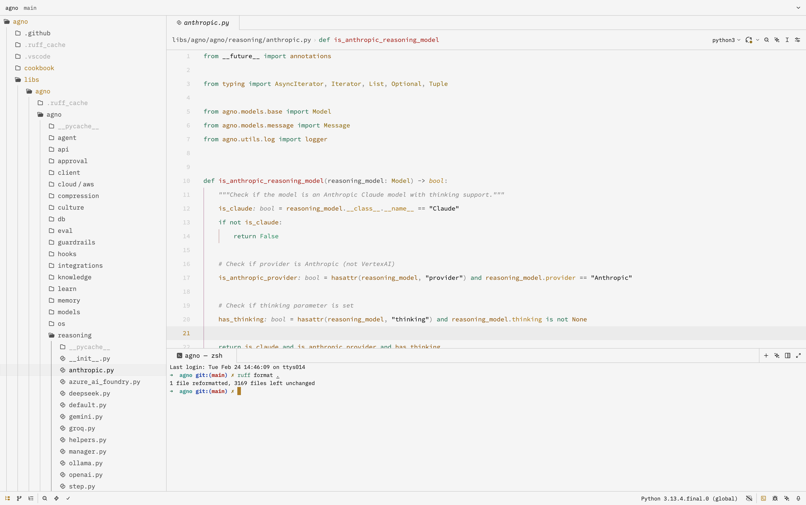

## Matt White

A clean and minimal light theme for the [Zed Editor](https://zed.dev).

Designed for long coding sessions with reduced visual noise and balanced contrast.

## Acknowledgements

This theme is inspired by  
[Matte Black](https://github.com/tahayvr/matte-black-zed).

---

## License

MIT License
